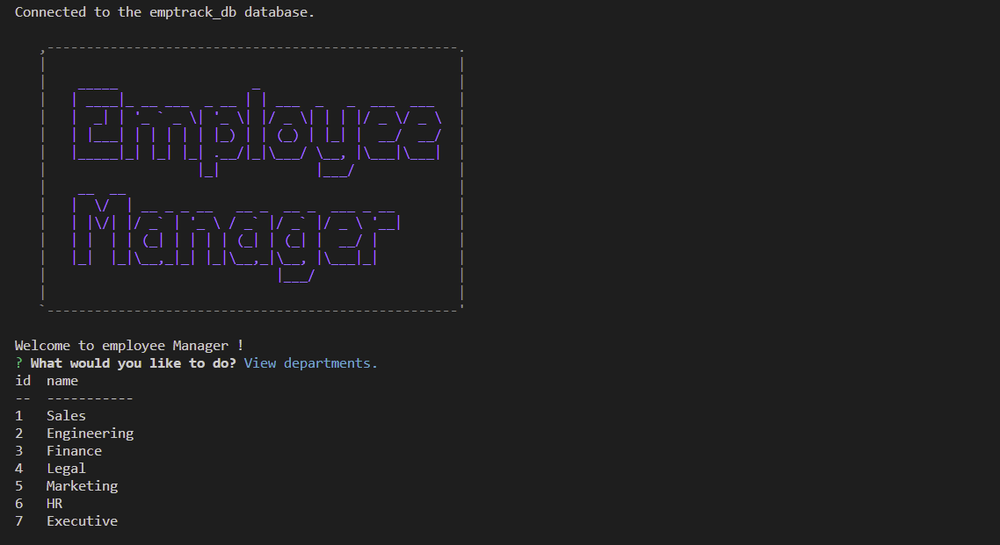
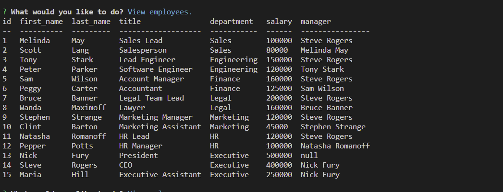
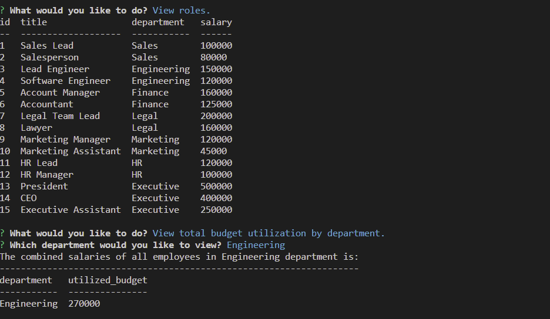
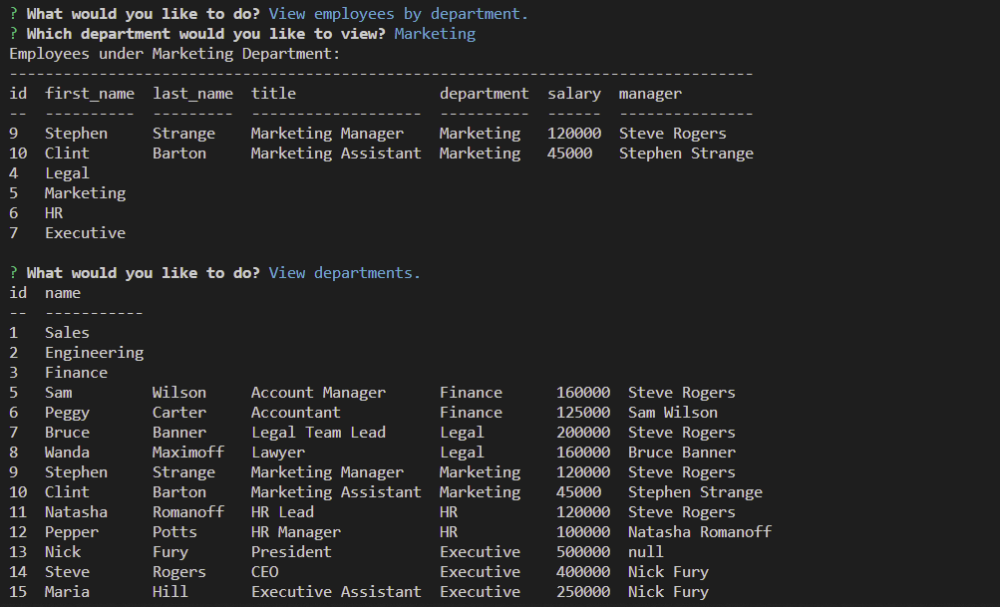

# Employee-Tracker

## Description

A command line application Content Management Systems for managing a company's employees. Utilizing node, inquirer and mySQL on the backend to provide the user with a large array of possible functions. The mySQL database schema has a table for departments, roles, and employees that allow for the user to manipulate the data within each table in several ways.  

Employee Manager System : 
add, view or delete  
  -employees 
  -departments 
  -roles 
view employee based on common managers 
view how much each department costing in salary 
update who is set as the manager of an employee 
update an employee's current role 

## Installation
-Download or clone repository 
-npm install to install the required npm packages  
-npm install mysql2 
-npm i inquirer@8.2.4 
-npm console.table 
-npm install asciiart-logo 
-Node.js is required to run the application 
Open VsCode Terminal
-open db folder
-type mysql -u root -p
-source schema.sql
-node index.js

## Usage
To run project on local mashine you also need to change password  
in index.js file to your personal (Mysql) password 
Also I used asciiart-logo for my project. But also you can use figlet.  

## Source link
Asciiart-logo:  https://github.com/tomi-vanek/asciiart-logo#readme
or 
npm install Figlet: https://www.npmjs.com/package/figlet

## Images of Deployed Application

## Video showing the functionality of the application

# Relevant Links
## Link video :
https://drive.google.com/file/d/1MfyvbB7sr4A-SZJwgIcv97p7J_SU3zt3/view

## GitHub Repo:
https://github.com/Mary90272/Employee-Tracker
